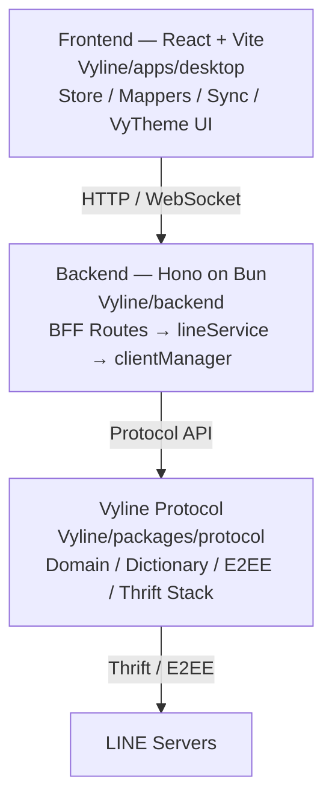

[日本語](README.md)

<h1 align="center">Vyline <sup>Beta</sup></h1>

<p align="center">
  <strong>Vision Beyond Limits.</strong><br/>
  An extensible third-party LINE client powered by its own protocol stack
</p>

<p align="center">
  
  
  
  
  
  
</p>

<p align="center">We are grateful to everyone who chooses Vyline under this bright sun.</p>

<p align="center">
  <a href="#what-is-vyline">Overview</a> ·
  <a href="#main-features">Features</a> ·
  <a href="#installation-and-updates">Install & Update</a> ·
  <a href="#support-vyline">Support & Contribute</a> ·
  <a href="#public-api">API</a> ·
  <a href="#documentation">Documentation</a> ·
  <a href="#roadmap">Roadmap</a>
</p>

> [!CAUTION]
> Vyline is an **unofficial and unauthorised** third-party LINE client. It is not affiliated with LINE Corporation or LY Corporation. Use it at your own risk after understanding possible consequences, including terms-of-service violations and account suspension.

> [!NOTE]
> Vyline was first released publicly as Beta 0.5.0 on August 20, 2026. The current version is **Beta 0.8.0**. Because this is beta software, specifications may change and bugs or data loss may occur.

---

## What is Vyline?

**Vyline** is a Web / React-based LINE client with messaging, Flex / Rich rendering, theme customisation, Snapshot, and more.

It communicates with LINE servers through the independently implemented **`@vyline/protocol`** package without relying on an external relay service. The UI, backend, and protocol layers are separated so the project can expand into themes, a public API, plugins, and custom clients.

| Item | Description |
| --- | --- |
| Target users | Users who want a customisable UI, developers, and self-hosters |
| Highlights | In-house protocol stack, VyTheme, public API, local-first data management |
| Technology | React + Vite / Hono on Bun / TypeScript / Thrift |
| Status | Beta 0.8.0 |
| License | MIT |

## Main features

The table below summarizes implemented product areas. Verification depth varies by feature, especially when a live LINE environment is required; see the [Feature Capability Matrix](docs/feature-capabilities.md) for the current evidence status.

| Category | Description |
| --- | --- |
| **Login** | QR / Email login, multiple accounts, session restore, automatic V3 access-token refresh |
| **Messages** | Send/receive, reply, unsend, read control, resend |
| **Mentions** | `@ALL` / `@name`, LINE Desktop-compatible `MENTION` metadata |
| **Media** | Images, video, audio, LINE emoji (sticon), stickers, automatic image compression, and high-quality image sending |
| **Flex / Rich** | Rendering based on official formats and mouse-drag support for carousels |
| **Reactions** | One-click reactions, official badges, read-receipt viewer |
| **Calls** | Voice / video calls (experimental) |
| **Chat management** | Pin, hide, mute, block, copy MID, create groups, invite users |
| **VyTheme** | Themes, font size, display density, profile backgrounds |
| **E2EE** | Letter Sealing decryption/sending and LINE Desktop key import |
| **Privacy** | Streamer mode and PIN lock |
| **Beta features** | Block-status check with separate per-feature consent |
| **Snapshot** | Create, list, restore, and schedule data snapshots with `vyl snapshot` |
| **Setup & handoff** | Three-step Vyline Setup, per-MID settings, tamper-detected ZIP handoff containing settings only |
| **Diagnostics & safety** | Diagnostic logs with personal data masked, Windows DPAPI session protection, per-device sub-device verification |
| **For developers** | Bearer-token public API, OpenAPI 3.1, detailed JSONL logs, secure remote access through Tailscale |
| **Other** | Keep Memo, profile backgrounds, in-call badge, fast common-group display, chat export to TXT |

---

## Support Vyline

Vyline is an independently developed open-source project. Support is used to maintain the development environment, testing, servers, and documentation.

### Ways to support

| Method | Description |
| --- | --- |
| **PayPay** | Support through PayPay's send/receive feature |
| **Amazon Gift Card** | Support using Amazon gift cards |
| **Other gift cards** | Apple Gift Card, Google Play, Steam, etc. Please ask first |
| **Development / design** | Contributions to code, documentation, UI, icons, banners, and more |

For destinations and procedures, contact the project in advance using the contact information on [nezumi0627's GitHub profile](https://github.com/nezumi0627). Available support methods may vary.

> [!IMPORTANT]
> Support is optional and does not guarantee feature implementation, bug fixes, individual support, or future availability. Never post gift-card numbers, PayPay transfer information, sessions, tokens, or encryption keys in Issues, Pull Requests, or public chats. Refunds or cancellation may not be possible after a transfer.

### Maintainers

| Maintainer | Role |
| --- | --- |
| [nezumi0627](https://github.com/nezumi0627) | Lead developer |
| [YoseiUshida](https://github.com/youseiushida) | Regular maintainer |

### Development Partner

- [LEINs](https://github.com/areteruhiro/LEINs) — Development Partner

Vyline and LEINs remain independently developed and operated projects while cooperating on development and technical research when appropriate.

### Maintainers and contributors wanted

We welcome maintainers and contributors who can help sustain Vyline.

- **Maintainers**: Issue triage, PR reviews, releases, documentation maintenance
- **Development**: Bug fixes, APIs, protocol, UI, storage, tests
- **Design**: VyTheme, app icons, theme icons, banners
- **Documentation**: Setup, API reference, translation, troubleshooting

See the [contribution guide](docs/CONTRIBUTING.md) and start with an Issue or Pull Request.

---

## Important information before use

- **Account risk**: Using Vyline may violate LINE's terms of service and may lead to actions such as account suspension.
- **Consent gate**: Terms and disclaimers are shown after login. App functionality, including sync, communication, and message display, does not start until consent is completed. Bypassing or modifying the gate is unsupported.
- **Intended use**: Vyline is intended for education, learning, research, and personal use. Unauthorised access, attacks, harassment, and rights violations are prohibited.
- **Data storage**: Login information, sessions, encryption keys, and chat history are stored in the local environment or self-hosted environment controlled by the user. Except for communication required for normal operation, they are not sent to external servers operated by Vyline developers.
- **Login continuity**: For V3-capable logins, Vyline stores the refresh credential and refresh timing locally and automatically refreshes the access token when needed. By default it starts refreshing seven days before LINE's refresh target; Settings > Login & Session can change that margin, for example to one day. Vyline does not need to stay open continuously: startup checks the stored timing and refreshes first when required. Saved sessions remain restorable while LINE-side device authorization stays valid. If device authorization is revoked or expires, interactive login is required. See [token lifecycle](docs/analysis/token-lifecycle.md) for details.
- **No warranty**: Developers and contributors are not responsible for account suspension, data corruption, loss, legal issues, or other consequences arising from use of the software.
- **Analysis tools**: `tools/` references [vyline-search](https://github.com/nezumi0627/vyline-search) as a Git submodule. Use it only for education and research and do not redistribute analysis targets or results inappropriately. See [docs/tools/DISCLAIMER.md](docs/tools/DISCLAIMER.md).
- **Beta features**: Features in the Beta Features tab show separate explanations and consent per feature in addition to the overall terms consent. Consent logs and beta-feature results remain on the device; message bodies and check results are not sent to external Vyline services. Normal LINE communication still occurs. This is not legal advice.

---

## Installation and updates

### Choose a method

| Use case | Recommended method | Description |
| --- | --- | --- |
| First-time trial | Interactive `vyl` setup | Choose installation, diagnostics, or repair without manually learning the entire setup first |
| Development / testing | Bun + source code | Run the frontend and backend independently |
| Home server / multiple devices | Docker Compose | Persist data in a volume and use Vyline from a web browser |
| Standalone Windows app | Beta supported | Use `VylineSetup-<version>.exe` from GitHub Releases |
| Standalone Linux app | Beta supported | Use `Vyline-linux-x64-<version>.tar.gz` from GitHub Releases |

> [!NOTE]
> Windows and Linux builds are available through GitHub Releases. Use Docker Compose for server deployments.

### Start with vyl (recommended)

`vyl` is the entry point for installing, diagnosing, repairing, starting Vyline, creating plugins, and making Snapshots. After npm / Bun publishing, the intended flow is:

```bash
bunx vyl init
bunx vyl install
bunx vyl doctor
```

Inside this repository, the same flow can be tested before publishing:

```bash
bun install
bun run vyl init
bun run vyl:doctor
bun run vyl:fix
```

`vyl install` supports not only a normal full clone but also archive-first installation and developer shallow clone. If an existing setup is broken, use `vyl doctor` to inspect it and `vyl fix` to repair `.env`, `data/`, `storage/`, submodules, and dependencies.

### Install from source (Bun)

- [Git](https://git-scm.com/)
- [Bun](https://bun.sh/)

### Run the development environment

```bash
git clone --recurse-submodules https://github.com/nezumi0627/Vyline.git
cd Vyline
# Configure environment variables if needed (macOS / Linux / Git Bash)
cp .env.example .env
bun install
bun run vyl:doctor
bun run dev
```

For PowerShell:

```powershell
Copy-Item .env.example .env
```

Then open `http://localhost:5173` in your browser. The backend listens on `http://localhost:3001`.

`bun install` installs dependencies for the entire workspace. You do not need to run install separately inside `Vyline/backend` or `Vyline/apps/desktop`.

| Command | Description |
| --- | --- |
| `bun run vyl init` | Interactive setup |
| `bun run vyl:doctor` | Environment diagnostics |
| `bun run vyl:fix` | Repair common setup issues |
| `bun run dev` | Start backend and frontend together |
| `bun run dev:backend` | Start backend only (`:3001`) |
| `bun run dev:frontend` | Start frontend only (`:5173`) |
| `bun run typecheck` | Type-check all workspaces |
| `bun run lint` | Lint with Biome |
| `bun run build` | Production frontend build |

For more details, see [Vyline/docs/vyl-cli.md](Vyline/docs/vyl-cli.md), [onboarding](docs/onboarding.md), and the [development guide](docs/development.md).

### Updating a Bun environment

If you have local modifications, commit or stash them first. Creating a Snapshot before updating is recommended.

```bash
bun run vyl snapshot create before-update
git status --short
git pull --ff-only
bun install
bun run vyl:doctor
bun run typecheck
bun run dev
```

If `git pull --ff-only` fails, inspect local changes and merge or rebase manually. You do not need to erase changes with `git reset --hard`.

### Snapshot

The previous backup/restore flow is now organised as **Snapshot**. A Snapshot stores `data/` in a restorable archive.

```bash
bun run vyl snapshot create manual
bun run vyl snapshot list
bun run vyl snapshot restore snapshots/vyline-snapshot-xxxx.tar.gz --force
bun run vyl snapshot schedule daily
```

On Windows, `snapshot schedule` attempts to register a `VylineSnapshot` scheduled task. On other platforms it prints a command suitable for cron / systemd timer.

### Install with Docker

```bash
git clone --recurse-submodules https://github.com/nezumi0627/Vyline.git
cd Vyline
docker compose up -d --build
```

Open `http://localhost:3000`. The Docker build serves the frontend and backend from the same origin.

### Updating Docker

```bash
docker compose pull
docker compose up -d
```

To rebuild the image from source, use `git pull --ff-only && docker compose up -d --build`.

Even when `docker compose up -d --build` recreates an existing container, the host-side `./data/` directory is preserved. **Do not delete `data/`; it contains sessions and keys.**

Chat history, images, sessions, and other data persist in `./data/`, allowing the same LINE session to be used from multiple web browsers.

### Standalone Linux build

```bash
tar -xzf Vyline-linux-x64-<version>.tar.gz
cd Vyline-linux-x64-<version>
./install.sh
~/.local/bin/vyline
```

**Tailscale is recommended** for remote access. Run Vyline on your PC, install Tailscale on your phone, sign in with the same account, and connect to `http://100.x.y.z:3000`. When Tailscale is active, the backend log automatically prints the URL. See the [self-hosting guide](docs/selfhosting.md) for details.

### Default protocol profile

| Item | Default | Notes |
| --- | --- | --- |
| Client | `IOSIPAD 26.7.2` | Used for `x-line-application` |
| Profile OS | `iOS 18.0` | Identification value used by the protocol |
| Device mode | `IOSIPAD` | Can be changed with `VYLINE_DEVICE` |

> [!IMPORTANT]
> These are **protocol identification values** sent to LINE servers, not host-OS requirements for running Vyline. They are defined by `DesktopProfile` in `packages/protocol/src/desktop/types.ts`.

---

## Architecture



| Path | Role |
| --- | --- |
| `Vyline/apps/desktop` | React + Vite frontend |
| `Vyline/backend` | Hono-based BFF, authentication, sync, API |
| `Vyline/packages/protocol` | Domain model, dictionary, E2EE, Thrift communication |
| `Vyline/packages/line-types` | Vendored Thrift type definitions |
| `Vyline/packages/cli` | `vyl` CLI, diagnostics, repair, Snapshot, plugin scaffold |

See [docs/architecture.md](docs/architecture.md) for details.

---

## Public API

A self-hosted Vyline instance can be controlled from external tools and custom clients using Bearer tokens. The API is exposed under `/v1/`.

| Endpoint | Purpose |
| --- | --- |
| `/v1/*` | Token-authenticated Vyline API |
| `/openapi.json` | Machine-readable OpenAPI 3.1 specification |
| `/docs` | API documentation UI |
| `/swagger` | Swagger UI |

> [!TIP]
> Available endpoints may vary by version. Treat `/openapi.json` returned by the running server as authoritative.

### Create a token

Set `VYLINE_API_ADMIN_SECRET`, then create a token with the admin secret.

```bash
curl -X POST http://localhost:3001/v1/tokens \
  -H "Authorization: Bearer $VYLINE_API_ADMIN_SECRET" \
  -H "Content-Type: application/json" \
  -d '{"name":"my-bot","accountIds":["main"]}'
```

`accountIds` is a required allowlist. The issued token can only access the listed accounts.

### API example

```bash
curl http://localhost:3001/v1/accounts/{accountId}/chats \
  -H "Authorization: Bearer vyl_xxxx..."
```

> [!WARNING]
> Never include `VYLINE_API_ADMIN_SECRET`, issued tokens, sessions, or encryption keys in repositories or logs.

See [docs/api/openapi.md](docs/api/openapi.md) and the [public documentation](https://zensical.org) for API design and usage.

## Themes, plugins, and custom clients

Vyline aims to be an API-first, extensible client.

### VyTheme

You can customise themes, font size, display density, and profile backgrounds. The project plans to expand CSS variables, backgrounds, and custom selectors for UI elements so appearance can be changed without modifying code directly.

### Plugin system

The plugin system is being developed so functionality can be added with JavaScript / TypeScript. A scaffold can be created with `vyl`.

```bash
bun run vyl plugin create my-plugin
```

- Declare plugin metadata and compatible versions in a manifest
- Permission scopes per API and permission review during installation
- Autocomplete-friendly type definitions and a stable Open API
- Lifecycle management for start, stop, update, and disable
- Versioning policy for compatibility-breaking changes

### Custom clients

Vyline is being designed so its public API and OpenAPI specification can be used to build custom UIs, bots, and integration tools on top of the Vyline backend.

---

## E2EE / LINE Desktop keys

Decrypting historical Letter Sealing messages requires your own key set extracted from the official LINE Desktop client.

1. Extract the keys while LINE Desktop is running ([docs/analysis/](docs/analysis/)).
2. Place the keys in `backend/data/desktop-e2ee-keys.json`.
3. The backend imports them automatically at startup.

> [!CAUTION]
> `desktop-e2ee-keys.json` contains sensitive information. Keep it covered by `.gitignore`; never commit, share, or log it.

---

## Breaking changes in v0.5.0

v0.5.0 is not compatible with v0.4.x. During an upgrade, some existing settings and cache data may need to be recreated.

| Change | Impact |
| --- | --- |
| Replaced the receive engine from Push long-polling to `fetchOps` | Event-polling behaviour changes |
| Added the public API (`/v1/`) | Token management becomes available when `VYLINE_API_ADMIN_SECRET` is configured |
| Added calls, member changes, announcements, and other events | Not compatible with the old frontend |

```bash
git pull
bun install
bun run dev
```

Existing login state is preserved. See [CHANGELOG.md](CHANGELOG.md) for detailed changes.

---

## Versioning

Vyline uses semantic versioning (`X.Y.Z`, or `X.Y.Z-beta` during beta). Releases use a Git tag `v<version>` such as `v0.6.0-beta`.

The following **four locations must stay in sync**:

| Location | Field |
| --- | --- |
| Root `package.json` | `version` |
| `Vyline/apps/desktop/package.json` | `version` |
| `Vyline/apps/desktop/src/lib/store.ts` | `UPDATE_NOTES.version` (`title` / `items` contain user-facing update notes) |
| `README.md` | `version-...` badge |

Use the bump script to update these locations together:

```bash
bun run bump -- 0.7.0
bun run bump -- patch
```

The script updates the version locations above and the README badge. `UPDATE_NOTES.items` and the CHANGELOG entry are updated manually (or by an AI agent) for each release. See the Version Management section in [AGENTS.md](AGENTS.md).

---

## Analysis toolkit

[vyline-search](https://github.com/nezumi0627/vyline-search) is an independent toolkit for unpacking LINE Desktop, searching native symbols, and decompilation. It can run string-xref-based `findNativeSymbol` and Ghidra decompilation in a single command.

> [!WARNING]
> Fully exit LINE Desktop before unpacking or updating. While LINE is running, single-instance control can reject Frida injection and cause `ProcessNotRespondingError`.

```powershell
bun run vyline:check                       # Compare installed and latest versions
bun run vyline:versions                    # List installed versions
bun run vyline:unpack -- --version <ver>   # Unpack a selected version
bun run vyline:update                      # Update LINE Desktop
bun run vyline:find-native -- sendMessage  # Search native symbols
```

Use the analysis tools only for education and research. See [docs/tools/DISCLAIMER.md](docs/tools/DISCLAIMER.md) for the full disclaimer.

---

## Documentation

| Document | Description |
| --- | --- |
| [docs/start-here.md](docs/start-here.md) | **General-user entry point** |
| [docs/README.md](docs/README.md) | Documentation index |
| [docs/feature-capabilities.md](docs/feature-capabilities.md) | Per-feature verification status and evidence |
| [docs/DOCS_OWNERSHIP.md](docs/DOCS_OWNERSHIP.md) | Documentation source-of-truth / ownership map |
| [Vyline/docs/vyl-cli.md](Vyline/docs/vyl-cli.md) | `vyl` CLI, interactive setup, diagnostics, repair, Snapshot |
| [docs/onboarding.md](docs/onboarding.md) | Initial setup |
| [docs/development.md](docs/development.md) | Development environment and commands |
| [docs/architecture.md](docs/architecture.md) | Architecture |
| [docs/selfhosting.md](docs/selfhosting.md) | Docker and Cloudflare Access |
| [docs/protocol/dictionary.md](docs/protocol/dictionary.md) | RPC dictionary |
| [docs/api/openapi.md](docs/api/openapi.md) | OpenAPI and public API |
| [docs/developers/index.md](docs/developers/index.md) | **Developer guide with recommended reading order** |
| [docs/developers/plugin-system.md](docs/developers/plugin-system.md) | Plugin development with examples |
| [docs/developers/for-ai.md](docs/developers/for-ai.md) | Docs router for AI agents |
| [examples/](examples/) | Plugin and API sample code |
| [docs/user-guide/update.md](docs/user-guide/update.md) | Update instructions |
| [docs/user-guide/custom-client.md](docs/user-guide/custom-client.md) | Building a custom client |
| [docs/user-guide/themes.md](docs/user-guide/themes.md) | Creating themes (VyTheme) |
| [docs/CONTRIBUTING.md](docs/CONTRIBUTING.md) | Contribution guide |
| [AGENTS.md](AGENTS.md) | Guide for coding agents |
| [CHANGELOG.md](CHANGELOG.md) | Change history |

Public documentation and API reference: **[zensical.org](https://zensical.org)**

---

## Roadmap

- **API / Swagger**: Improve and stabilise `/v1/`, `/openapi.json`, `/docs`, and `/swagger`
- **vyl CLI**: Improve installation, diagnostics, repair, Snapshot, and plugin-scaffold flows
- **Plugin system**: JavaScript / TypeScript, permission scopes, typed Open API
- **Custom clients**: Integration with custom frontends, bots, and external tools
- **Multiple accounts**: Per-account separation of authentication, data, and media
- **Storage management**: Separate cache and saved media, display storage usage, create and restore Snapshots
- **Multi-image sending**: Individual IMAGE messages with grouped display
- **Server mode**: Improve Docker Compose and self-hosted operation
- **Performance**: Measure memory, CPU, and network traffic and target lower usage than the official client

### Vyline Desktop — Coming Soon

After the stable release, a dedicated desktop app, **Vyline Desktop**, is planned.

- Windows / macOS / Linux support
- Native notifications and quick replies
- System-tray integration
- Full control of local data

---

## Contributing

Contributions to bug fixes, feature improvements, documentation, and design are welcome.

- [Report a bug](.github/ISSUE_TEMPLATE/bug_report.md)
- [Propose a feature](.github/ISSUE_TEMPLATE/feature_request.md)
- [Create a Pull Request](.github/pull_request_template.md)

Read the [contribution guide](docs/CONTRIBUTING.md) before participating. Never include analysed software, sessions, keys, tokens, or other sensitive information in a Pull Request.

For parallel development, Vyline recommends **`1 task = 1 branch = 1 git worktree`**. Do not clone or copy the whole repository for each feature; create a task-specific worktree under `Vyline-worktrees` instead. See [Git Worktree development](docs/development-worktrees.md) for the workflow.

### Agent / Skill policy

Development may use coding-agent Skills such as Ponytail, Caveman, agent-skills-standard, addyosmani agent-skills, and Minimize-Cursor-Cost as needed. Their purpose is to avoid unnecessary code and overengineering while maintaining review quality.

Priority order:

1. Security
2. Privacy
3. Data protection
4. Compatibility with existing functionality
5. Reduction of implementation size, tokens, and cost

Accuracy and safety take priority over efficiency. See [AGENTS.md](AGENTS.md) for details.

---

## References

The following projects were consulted as technical references during Vyline research, investigation, and implementation.

Unless otherwise stated, there is no official partnership, affiliation, endorsement, or other deep relationship between these projects or their developers and Vyline.

- [CHRLINE (old)](https://github.com/DeachSword/CHRLINE)
- [CHRLINE-Thrift](https://github.com/DeachSword/CHRLINE-Thrift/)
- [CHRLINE-Patch](https://github.com/WEDeach/CHRLINE-Patch)
- [linejs](https://github.com/evex-dev/linejs)
- [line-py](https://github.com/fadhiilrachman/line-py)

---

## License and copyright

Vyline is released under the [MIT License](LICENSE).

Copyright © [nezumi0627](https://github.com/nezumi0627)

If you modify or redistribute Vyline, retain the copyright and license notices contained in `LICENSE`.

---

<p align="center">
  <strong>Vision Beyond Limits.</strong><br/>
  Built with care by <a href="https://github.com/nezumi0627">nezumi0627</a> and contributors.
</p>
